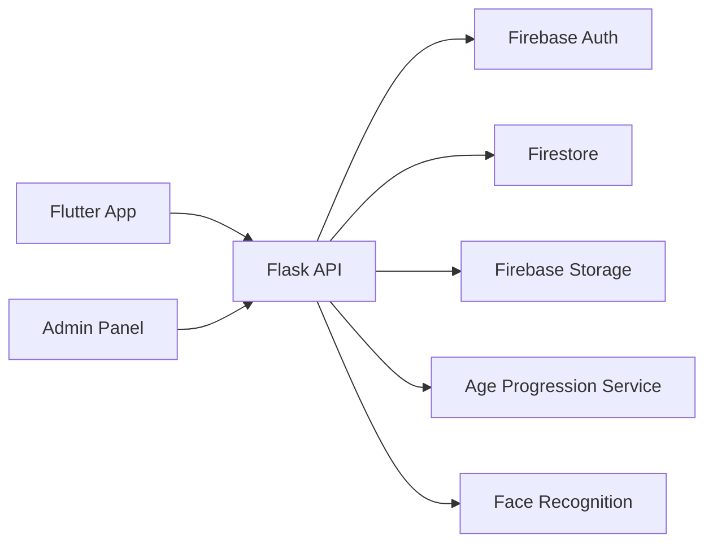

# 🔎 SafeFind — Missing Persons Recovery Platform (AI Age Progression + Face Recognition)

A production-ready backend that combines **age progression** and **face recognition** to locate missing people.  
Built with **Flask (Python)** and **Firebase** (Auth, Firestore, Storage), with an admin surface for moderating reports and users.

---

## ✨ Key Features

- **Account & Profiles**
  - Register / Login (Firebase Auth)
  - Update profile, avatar, phone
  - Role-based access: **user**, **admin**

- **Posts (Missing / Found)**
  - Create/update/delete posts with images and metadata
  - Report suspicious/spam posts
  - List & view posts (recent first)

- **Search**
  - Upload a photo → system **age-progresses** the face to a target age → runs **face similarity** against database → returns the **closest match** (with uploader contact, if available)

- **Admin Tools**
  - List users (paged), **suspend/unsuspend** users
  - Review post reports, delete posts
  - Stats: users, found posts, reports, successful / unsuccessful matches

- **Image Pipeline**
  - Type & size validation, blur detection, square crop, resize, JPEG encode
  - Public URL upload to **Firebase Storage**

---

## 🧱 Tech Stack

- **Backend:** Flask (Python 3.11+)
- **AI / CV:** Age progression service (FastAPI endpoint), FaceNet embeddings + cosine distance
- **Data:** Firebase Firestore + Storage
- **Auth:** Firebase Auth (ID tokens)
- **Image:** OpenCV, PIL
- **ML tooling:** PyTorch (age progression), LFW/FFHQ datasets (training utilities)

---

## 🗺️ Architecture (high level)

---

## 🧩 API (summary)

### Auth
- `POST /register` — create account (validates email/phone/password)
- `POST /login` — password login (returns tokens + profile)
- `PATCH /update-profile` — update profile (auth)
- `GET /me` — current user (auth)

### Posts
- `POST /posts/missing` — create missing-person post (auth; multipart: `image_file` + fields)
- `POST /posts/found` — create found-person post (auth; multipart)
- `PATCH /posts/<post_id>` — update post (auth; can replace image)
- `DELETE /posts/<post_id>` — delete own post (auth)
- `GET /posts` — list posts (recent first)
- `GET /posts/<post_id>` — get a post
- `POST /posts/<post_id>/report` — report a post (auth)

### Search & Age Progression
- `POST /age-progress` — **multipart** (`image`, `target_age`) or **JSON** (`image_b64`, `target_age`); returns progressed image URL and closest match (if any)
- `POST /search` — image-based search across candidates; returns best match with distance

### Admin (prefix `/admin`, admin-only)
- `GET /users` — list users (paged)
- `PATCH /users/<uid>/status` — suspend/unsuspend user
- `GET /reports` — list post reports
- `DELETE /posts/<post_id>` — delete any post
- `GET /matches/successful/count` — successful matches count
- `GET /matches/unsuccessful/count` — unsuccessful matches count

---

## 🗃️ Data Model (core)

**User**
- `uid, email, first_name, last_name, phone, photo_url, role("user"|"admin"), created_at`
- Helpers: `is_owner(uid)`, `get_full_name()`, `get_created_at_iso()`

**Post**
- `id, uid, author_name, post_type("missing"|"found"), image_url, created_at, status`
- `payload` (typed by post_type), e.g.  
  - missing: `missing_name, missing_age, last_seen, notes, gender, ...`  
  - found: `found_name, estimated_age, found_location, gender, ...`

---

## 🖼️ Image Preprocessing

- Accepts **JPEG/PNG**
- Rejects small images (`min(side) < MIN_IMAGE_SIDE`) or **blurry** images (Laplacian variance < threshold)
- **Center crop** to square, resize (≤ `IMAGE_RESIZE_TO`), **encode JPEG** (`JPEG_QUALITY`)
- Uploads to Storage under:
  - `missing_posts/{uid}/{uuid}.jpg`
  - `found_posts/{uid}/{uuid}.jpg`

---

## 🧠 Face Recognition & Age Progression

- **Face recognition**: FaceNet embeddings + **cosine distance**; **lower is more similar**; default threshold `0.40`
- **Age progression**: external FastAPI endpoint (`/age-transform`) that returns a transformed face; backend uploads the result then performs similarity search

---

## 🛡️ Security & Privacy

- **Auth**: Firebase ID tokens on all user actions; `admin_required` guard for admin routes
- **PII**: Stores minimal necessary fields; images stored on Firebase Storage
- **Abuse handling**: Post reporting + admin moderation
- **Transport**: Use HTTPS for all public endpoints; secure service account JSON

---

## 🧪 (Optional) Training Utilities

- **Age progression model (prototype)**: PyTorch encoder–age–decoder trained on **FFHQ**; Google Drive download helpers; saves `FFHQ_age_progression.pth`
- **Face recognition pairs**: Utility to create **LFW** positive/negative pairs for Siamese training/eval

---

## ✅ Checklist for Deployment

- [ ] Set all environment variables on your host
- [ ] Upload service account JSON and set `GOOGLE_APPLICATION_CREDENTIALS`
- [ ] Create Firestore indexes if needed (composite by `created_at`)
- [ ] Lock down Storage rules appropriately
- [ ] Point `AGE_API_BASE_URL` to your FastAPI/Colab/ngrok endpoint

---

